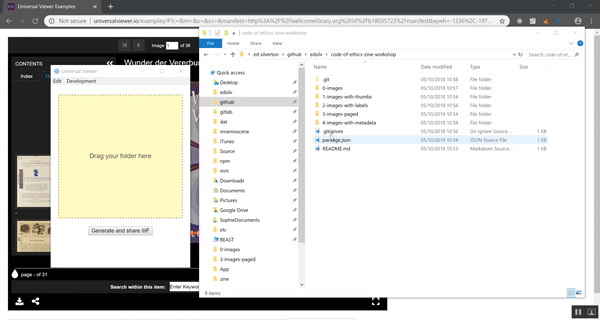

# uv.pub



Quickly generate [IIIF Presentation JSON](https://iiif.io/api/presentation/3.0/) for use in the [Universal Viewer](https://universalviewer.io).

UV.pub stores your IIIF assets in a [Dat](https://dat.foundation) archive. This can be used in conjunction with a tool like [FuseBot](https://gitlab.com/mnemoscene/fusebot) to preserve your Dat archive on a server, and make it available over HTTP.

UV.pub is built with [Electron](http://electron.atom.io) and [biiif](http://github.com/edsilv/biiif)

# Contributing

1. Fork [this repository](https://github.com/UniversalViewer/uv.pub) and create your
   branch from `master`.
2. Make your change.
3. Send a pull request.
4. Sign the [CLA](https://cla-assistant.io/UniversalViewer/uv.pub), if you haven't
   already.


# Quick start

The sole development dependency of this project is [Node.js](https://nodejs.org), so make sure you have it installed.
Then type the following commands known to every Node developer...
```
git clone https://github.com/universalviewer/uv.pub.git
cd uv.pub
npm install
npm start
```
...and boom! You have a running desktop application on your screen.

# Structure of the project

The application consists of two main folders...

`src` - files within this folder get transpiled or compiled (because Electron can't use them directly).

`app` - contains all static assets (put here images, css, html etc.) which don't need any pre-processing.

The build process compiles the content of the `src` folder and puts it into the `app` folder, so after the build has finished, your `app` folder contains the full, runnable application.

Treat `src` and `app` folders like two halves of one bigger thing.

The drawback of this design is that `app` folder contains some files which should be git-ignored and some which shouldn't (see `.gitignore` file). But this two-folders split makes development builds much, much faster.

# Development

## Starting the app

```
npm start
```

## The build pipeline

Build process uses [Webpack](https://webpack.js.org/). The entry-points of your code are the files `src/background.js` and `src/app.js`. Webpack will follow all `import` statements starting from those files and compile code of the whole dependency tree into one `.js` file for each entry point.

[Babel](http://babeljs.io/) is also utilised, but mainly for its great error messages. Electron runs under the hood latest Chromium, hence most of the new JavaScript features is already natively supported.

## Environments

Environmental variables are done in a bit different way (not via `process.env`). Env files are plain JSONs in `config` directory, and build process dynamically links one of them as an `env` module. You can import it wherever in code you need access to the environment.
```js
import env from "env";
console.log(env.name);
```

## Upgrading Electron version

To do so edit `package.json`:
```json
"devDependencies": {
  "electron": "1.7.9"
}
```
*Side note:* [Electron authors recommend](http://electron.atom.io/docs/tutorial/electron-versioning/) to use fixed version here.

## Adding npm modules to your app

Remember to respect the split between `dependencies` and `devDependencies` in `package.json` file. Your distributable app will contain modules listed in `dependencies` after running the release script.

*Side note:* If the module you want to use in your app is a native one (not pure JavaScript but compiled binary) you should first  run `npm install name_of_npm_module --save` and then `npm run postinstall` to rebuild the module for Electron. You need to do this once after you're first time installing the module. Later on the postinstall script will fire automatically with every `npm install`.

# Testing

Run all tests:
```
npm test
```

## Unit

```
npm run unit
```
Using [electron-mocha](https://github.com/jprichardson/electron-mocha) test runner with the [Chai](http://chaijs.com/api/assert/) assertion library. You can put your spec files wherever you want within the `src` directory, just name them with the `.spec.js` pattern.

## End to end

```
npm run e2e
```
Using [Mocha](https://mochajs.org/) and [Spectron](http://electron.atom.io/spectron/). This task will run all files in `e2e` directory with pattern `.e2e.js`.

# Making a release

To package your app into an installer use command:
```
npm run release
```

It will start the packaging process. Once the process finished, the `dist` directory will contain your distributable file.

We use [electron-builder](https://github.com/electron-userland/electron-builder) to handle the packaging process. It has a lot of [customization options](https://www.electron.build/configuration/configuration), which you can declare under `"build"` key in `package.json`.

You can package your app cross-platform from a single operating system, [electron-builder kind of supports this](https://www.electron.build/multi-platform-build), but there are limitations and asterisks. That's why this boilerplate doesn't do that by default.
